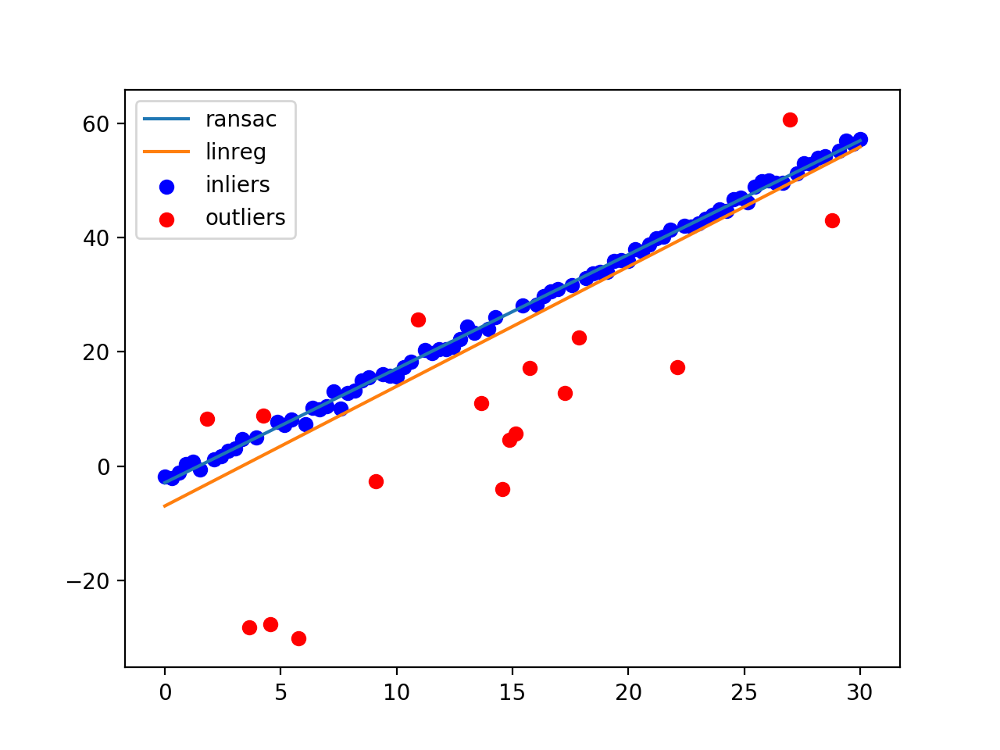
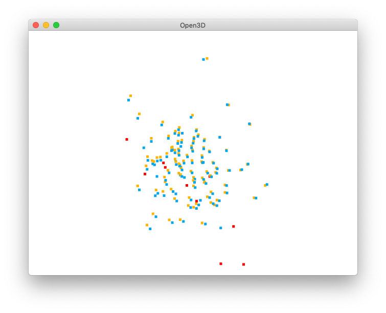
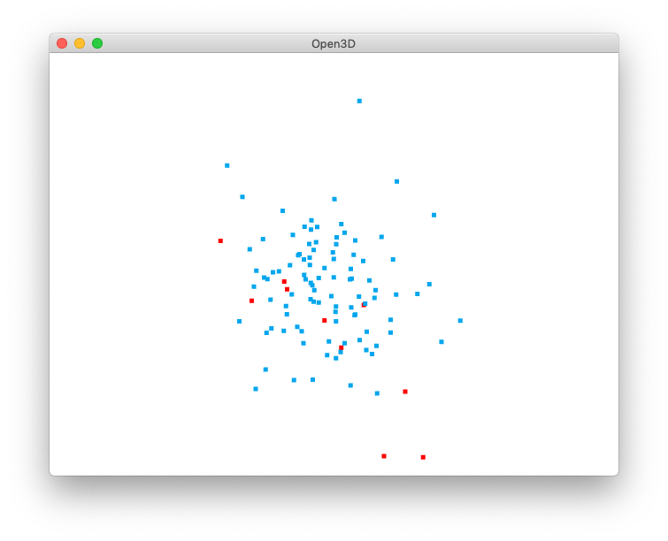
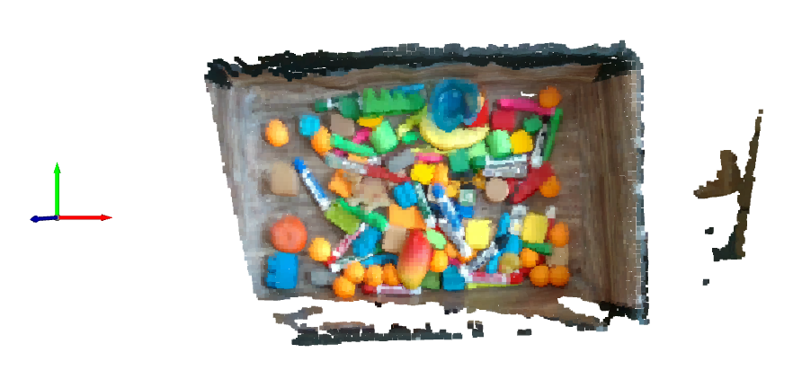
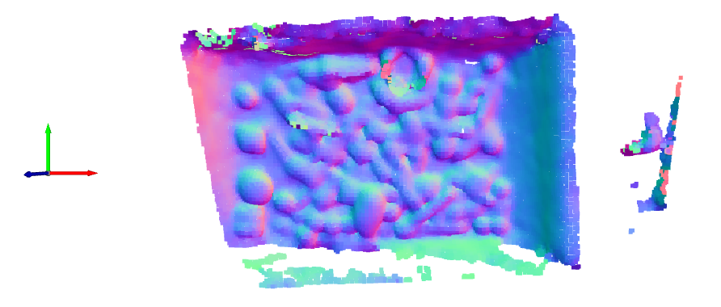

# learn-ransac

Learning about the different uses of [RANSAC](https://en.wikipedia.org/wiki/Random_sample_consensus): Ransom Sample Consensus.

RANSAC is an interative method for estimating the parameters of a model from data that contains outliers.

## API

```python
from ransac import RansacEstimator

# estimate with RANSAC
ransac = RansacEstimator(
    min_samples=3,
    residual_threshold=0.001,
    max_trials=1000,
)
ret = ransac.fit(Procrustes(), [src_pc, dst_pc])

# extract best values
transform4x4_ransac = ret["best_params"]
mse_ransac = ret["best_residual"]
inliers_ransac = ret["best_inliers"]
```

## 2D Linear Regression (Ordinary Least Squares)

[Code](lin_reg.py)

As a toy example, we'll be corrupting a linear function of `x` with random outliers. Then we'll plot the predicted line from RANSAC and linear regression.

<p align="center">

</p>

Notice how the line determined by linear regression is influenced by the outliers. On the other hand, the line found by RANSAC is able to detect outliers (based on the threshold parameter) and thus more closely fits the data.

## Rigid Transform Estimation

[Code](procrustes.py)

Suppose we are given two point clouds and we would like to estimate the rigid transformation that aligns the first point cloud to the other.

In the regular setting, we assume the point correspondences between both point clouds are correct and compute the optimal rigid transform using SVD. This is known as the [Orthogonal Procrustes Problem](https://en.wikipedia.org/wiki/Orthogonal_Procrustes_problem).

But what happens if we have some outliers, i.e. bad point correspondences? This can happen for instance when calibrating a camera and a bad checkerboard center is detected. The answer ... RANSAC!

<p align="center">


</p>

In the figure above, the red points correspond to explicitly corrupted correspondences. On the left, we have the rigid transform computed the regular way, without using RANSAC. The blue and orange points are supposed to be superimposed. Notice how the outliers have affected the transformation and there is a slight offset between all points. On the right is the result of RANSAC + Procrustes. The blue points now completely superimpose the orange ones (not visible anymore) and are not affected by the red outliers.

## Point Cloud Normal Vector Estimation

[Code](normals.py)

Suppose we are given a 3D point cloud and we would like to compute a normal vector associated with every 3D point in the cloud. That is, we want to estimate the normal of a plane tangent to each point in the cloud. This problem is thus equivalent to fitting a plane to each point (in the neighborhood of the point) using least squares. It turns out that the normal vector that minimizes the sum of squared distances between each point and the best-fitting plane is the left singular vector associated with the smallest singular value (SVD to the rescue).

We can combine normal estimation with RANSAC to reduce the effect of outlier points. This is especially useful when the point cloud is very noisy or wavy.

<p align="center">


</p>

Note: With the current demo point cloud, it doesn't seem like RANSAC offers any performance advantage and it is significantly slower than the non-RANSAC variant. I'll have to test it out with more noisy point clouds.

## References

- [Kris Kitani's slides for 16-385](http://www.cs.cmu.edu/~16385/s17/Slides/10.3_2D_Alignment__RANSAC.pdf)
- [RANSAC for Dummies by Marco Zuliani](http://www.cs.tau.ac.il/~turkel/imagepapers/RANSAC4Dummies.pdf)
- [Robert Collins' slides for CSE486](http://www.cse.psu.edu/~rtc12/CSE486/lecture15.pdf)
- [`skimage` implementation](https://github.com/scikit-image/scikit-image/blob/master/skimage/measure/fit.py)