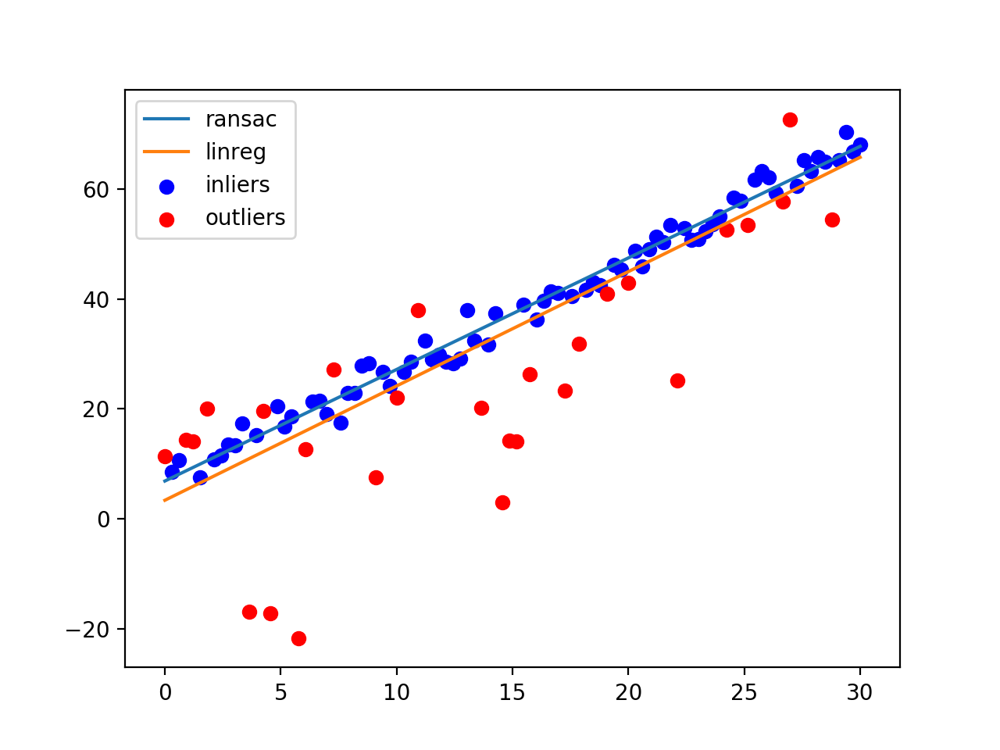

# learn-ransac

Learning about the different uses of [RANSAC](https://en.wikipedia.org/wiki/Random_sample_consensus): Ransom Sample Consensus.

RANSAC is an iterative method for estimating the parameters of a mathematical model from a set of observed data that contains outliers, when the outliers need to be ignored. It is non-deterministic; the more you let it run, the more reasonable the result.

## 2D Regression

As a toy example, we'll be corrupting a linear function of `x` with random outliers. Then we'll plot the predicted line from RANSAC and linear regression.

## References

- Kris Kitani's slides for 16-385: http://www.cs.cmu.edu/~16385/s17/Slides/10.3_2D_Alignment__RANSAC.pdf
- RANSAC for Dummies by Marco Zuliani: http://www.cs.tau.ac.il/~turkel/imagepapers/RANSAC4Dummies.pdf
- Robert Collins' slides for CSE486: http://www.cse.psu.edu/~rtc12/CSE486/lecture15.pdf
